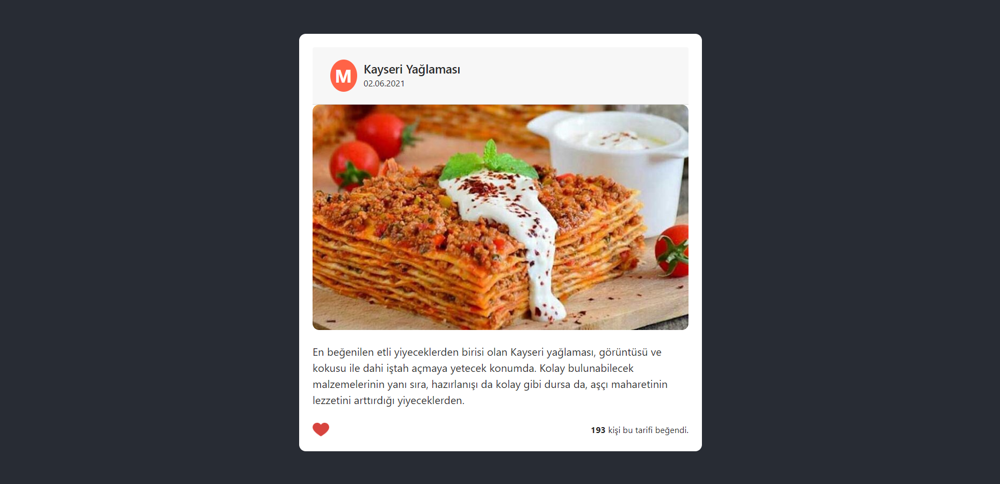

# Recipe Card with React

I have coded a basic recipe card with ReactJS to understand usage of components and props. These codes is also practice to see what I learned from <a href="https://www.patika.dev/egitimler/frontend-web-development-patikasi">Front-End Web Development Path</a>.

# Screenshot

